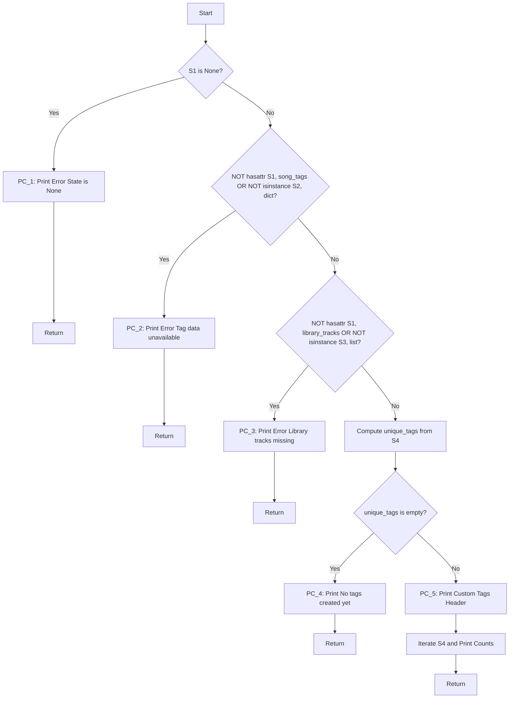

````markdown
# FILE 1: SYMBOLIC_ANALYSIS.md

# Symbolic Execution Analysis: `list_all_tags`

## 1. Implementation Analysis
The function under analysis is `list_all_tags`, which validates the integrity of a `PlayerState` object before aggregating and displaying distinct song tags. The logic follows a linear validation sequence with multiple early-exit safeguards before entering the computational core (tag aggregation and display).

```python
def list_all_tags(state: PlayerState) -> None:
    """
    Prints all tags currently existing in the library.
    """
    if state is None:
        print("[tags] Error: State is None.")
        return
    if not hasattr(state, "song_tags") or not isinstance(state.song_tags, dict):
        print("[tags] Error: Tag data is unavailable/corrupted.")
        return
    if not hasattr(state, "library_tracks") or not isinstance(state.library_tracks, list):
        print("[tags] Error: Library tracks missing/corrupted.")
        return
    unique_tags = set()
    for tags in state.song_tags.values():
        unique_tags.update(tags)

    if not unique_tags:
        print("[tags] No tags created yet.")
        return

    print("--- Custom Tags ---")
    for t in sorted(unique_tags):
        count = sum(1 for tags in state.song_tags.values() if t in tags)
        print(f"  #{t} ({count} songs)")
````

## 2. Symbolic Inputs

To facilitate formal verification, the concrete input variables are mapped to symbolic tokens. We treat the state object as `S1`, and its internal attributes as distinct symbolic components whose existence and type properties constitute the constraint system.

| Variable                 | Symbol | Type / Domain                    |
| ------------------------ | ------ | -------------------------------- |
| state                    | S1     | Object OR None                   |
| state.song_tags          | S2     | Dictionary OR Other OR Undefined |
| state.library_tracks     | S3     | List OR Other OR Undefined       |
| state.song_tags.values() | S4     | Collection of Lists              |

## 3. The Symbolic Tree

The following Control Flow Graph (CFG) represents the execution paths. Loops (the accumulation of tags and the printing iteration) are abstracted as single decision nodes determining entry or skip/exit, preventing infinite graph expansion while preserving logic coverage.



## 4. Path Conditions (PCs)

The following table formalises the Boolean logic required to traverse each specific path in the symbolic tree above. These conditions form the basis for test case generation.

| Path ID | Condition                                                                                                                              |
| ------- | -------------------------------------------------------------------------------------------------------------------------------------- |
| PC_1    | S1 == None                                                                                                                             |
| PC_2    | S1 != None AND (NOT hasattr(S1, "song_tags") OR NOT isinstance(S2, dict))                                                              |
| PC_3    | S1 != None AND (hasattr(S1, "song_tags") AND isinstance(S2, dict)) AND (NOT hasattr(S1, "library_tracks") OR NOT isinstance(S3, list)) |
| PC_4    | S1 != None AND Valid_Structure(S2, S3) AND (Union(S4) == Empty)                                                                        |
| PC_5    | S1 != None AND Valid_Structure(S2, S3) AND (Union(S4) != Empty)                                                                        |

```
```
