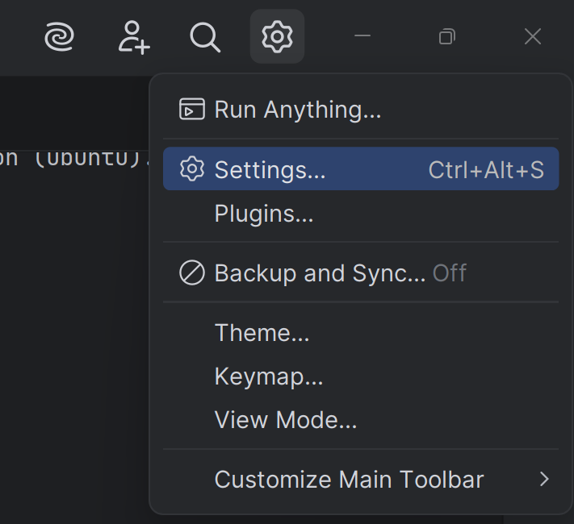
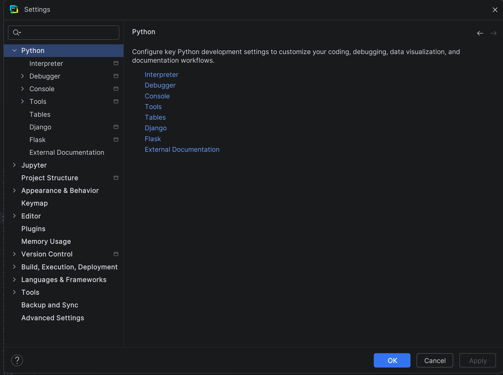
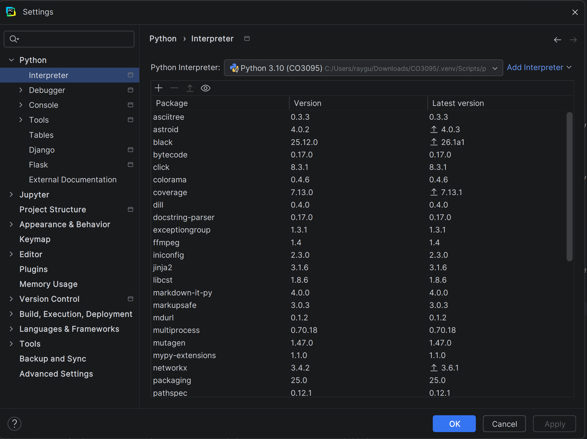
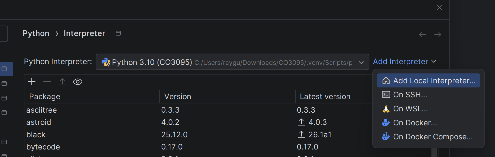
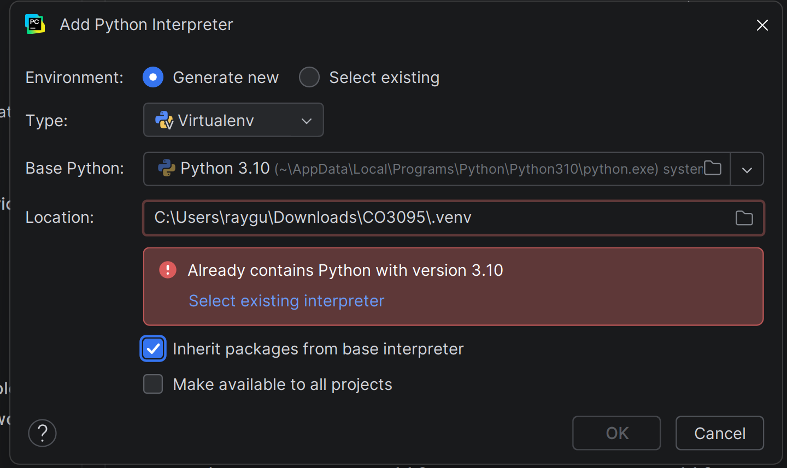
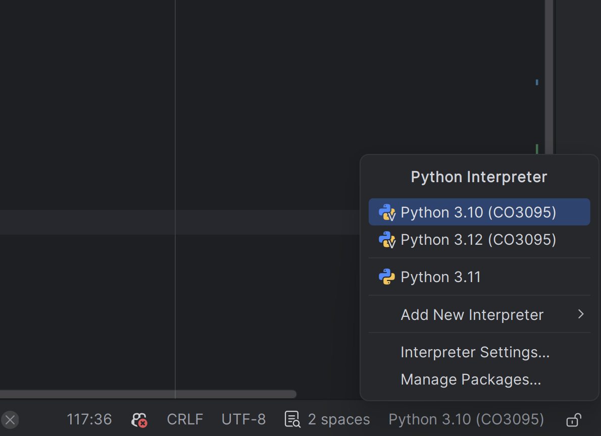
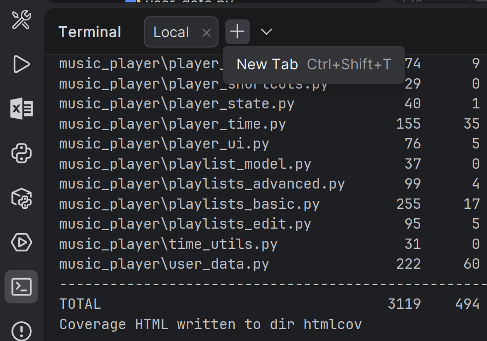
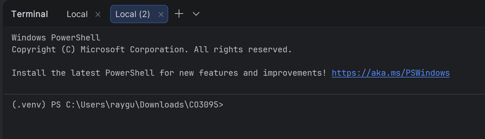

# CO3095 Software Measurement and Quality Assurance - Group 16 Music Player Application

## Team Members:
- Neel Patkar (np343)
- Raiyan Alam (ra495)
- Sanil Panchal (sp871)
- Samuel Ameyaw (sa1077)

## About the Project:
A command-line music player application developed as part of the CO3095 Software Measurement and Quality Assurance module at the University of Leicester. 

### Project Structure:
- `music_player/`: Main package containing the source code for the music player application.
- Inside the `music_player` python package:
   - `main.py`: Entry point, command routing and main CLI loop.
   - `config.py`: global configuration constants.
   - `library.py`: Loads tracks from disk into the library, reads metadata.
   - `player_core.py`: Core playback functionality - play, pause, stop.
   - `player_audio.py`: Audio controls setting volume level and mute
   - `player_seek.py`: Seek backwards or forwards within a track to any time. 
  - `player_state.py`: Shared player state.
  - `player_queue.py`: Queue management - add, remove, next, previous.
  - `player_help.py`: Help commands.
  - `player_ui.py`: progress bar, list and other visual outputs.
  - `player_shortcuts.py`: Shortcut commands for core features.
  - `playlist_model.py`, `playlists_basic.py`, `playlists_edit.py`, `playlists_advanced.py`: Playlist features.
  - `player_metrics.py`: Likes and top tracks.
  - `player_config.py`: Persistent player settings and tagging.
  - `player_time.py`: Resume track state, scheduling alarms, recently added songs.
  - `player_io.py`: Import songs, export playlists and update metadata.
  - `user_data.py`: User profiles, advanced search, ratings.
  - `audio_backend.py`: Audio playback backend implementation using pygame or simulated without pygame.
  - `library_search_scan.py`: Library search and scanning.
  - `time_utils.py`: Time formatting utilities.
- `songs/`: Directory where audio files should be placed for playback.
- `ra495/`, `np343/`, `sp871/`, `sa1077/`: Directories that contains all of the testing files.
- `Evidence/`: Contains documentated evidence of compliance with each of the CMMI Level 2 Process Areas. 

## Prerequisites:
- Python 3.10.x installed on your system.
  - verify installation by running `python --version` or `python3 --version` in your terminal or command prompt.
- pip package manager installed.
  - verify installation by running `pip --version` in your terminal or command prompt.
- PyCharm IDE installed on your system.
  - Download link: https://www.jetbrains.com/pycharm/download/
- Source code downloaded as a zip file (CO3095-Group-16-Music-Player-Application-1.0.zip).
  - From the Blackboard submission.

## Uncompressing the Project:
1. Extract the contents of the zip file to a desired location on your system using whatever extraction tool you prefer (Windows built in extraction, Winrar, 7-Zip, etc.). 
2. At the location you extracted the zip file, you should see an uncompressed folder named "CO3095-Group-16-Music-Player-Application-1.0". 
3. You have now successfully uncompressed the project.

## Importing the Project into PyCharm:
- Right click the uncompressed extracted folder "CO3095-Group-16-Music-Player-Application-1.0" and select "Open as PyCharm Project".
- Or, alternatively:
  1. Open PyCharm, select "Open", and navigate to the location where you extracted the zip file and select the folder "CO3095-Group-16-Music-Player-Application-1.0". 
  2. PyCharm will now load the project. 
  3. Wait for PyCharm to finish indexing the project files. 
  4. Once indexing is complete, you should see the project files in the "Project" pane on the left side of the PyCharm window that contains all of the same files from in the Project Structure. 
  5. You have now successfully imported the project into PyCharm.

## Installing Dependencies (requirements.txt):
- Run the following command in the terminal to install most of the required dependencies:
    ```
    pip install -r requirements.txt
    ```
- Alternatively here are the direct pip commands to run to install each dependency manually:
  ```
  pip install pygame
  pip install pytest
  pip install coverage
  pip install mutagen
  pip install pydub
  pip install ffmpeg   # if this doesn't install refer to the next section on installing ffmpeg
  ```
## Additional Dependency - ffmpeg:
- ffmpeg must be installed separately as it is cannot be installed via pip and instead must be installed directly on your system.
- Linux installation instructions:
  - On Linux Ubuntu run this command:
    ```
    sudo apt-get install ffmpeg
    ```
    - If this does not work download from https://ffmpeg.org/download.html and select the appropriate build for your distribution (Ubuntu).
    - Then follow steps 2-6 of the Windows installation instructions.
- Windows installation instructions:
  1. Download the Windows build from https://ffmpeg.org/download.html
  2. Extract the downloaded zip file to a location of your choice.
  3. Add the `bin` folder inside the extracted folder to your system's PATH environment variable. 
     - For example, if you extracted ffmpeg to `C:\ffmpeg`, add `C:\ffmpeg\bin` to your PATH.
  4. To verify the installation, open a new command prompt and run:
    ```
    ffmpeg -version
    ```
  5. If the installation was successful, you should see the version information for ffmpeg displayed in the terminal.
  6. You have now successfully installed ffmpeg.

## How to Run the Application:
1. Once you have installed all the dependencies, you can run the music player application.
2. In PyCharm, open the `music_player` python package project folder. Inside should be a file named `main.py`.
3. Right-click on `main.py` and select "Run 'main'".
4. The application should start running in the terminal within PyCharm.
5. Follow the on-screen instructions to use the music player application. (Use `/help` to see the full list of commands available)

## Adding Audio Files:
- The final version of the application does not include any audio files.
- If you want to test the application with audio files, you will need to add your own audio files to the `songs` directory located inside the project folder `music_player`.
- Currently supported audio formats are mp3, wav, flac, m4a and ogg.

## Testing:
- Create a venv to run test cases in:
  1. In PyCharm open the settings menu.
  
  2. On the left side where it says "Python" at the top, click it to reveal the drop-down option under it called "Interpreter". 
  
  3. Clicking on "Interpreter" will open the interpreter settings menu on the right pane.
  
  4. Choose the "Add Interpreter" option and select "Add Local Interpreter".
  
  5. Set:
     - Environment - Generate new
     - Type - Virtualenv
     - Base Python - 3.10
     - Inherit packages from base interpreter - SELECTED
  
  6. Press "OK" to create the venv.
  7. If the venv isn't automatically set it can be manually selected from the list of interpreters found at the bottom right of the IDE.
  
  8. To confirm the venv is now selected open a new tab in terminal and check for `(.venv)`.

  9. venv is confirmed and testing can now be performed.

- Test types include:
  - Black-box Specification
    - Command: ```pytest np343/test/blackbox/specification ra495/test/blackbox/specification sa1077/test/blackbox/specification sp871/test/blackbox/specification --cov=music_player --cov-report=term-missing --cov-report=html```
  - Black-box Random
    - Command: ```pytest np343/test/blackbox/random ra495/test/blackbox/random sa1077/test/blackbox/random sp871/test/blackbox/random --cov=music_player --cov-report=term-missing --cov-report=html```
  - White-box Statement
    - Command: ```pytest np343/test/whitebox/statement ra495/test/whitebox/statement sa1077/test/whitebox/statement sp871/test/whitebox/statement --cov=music_player --cov-report=term-missing --cov-report=html```
  - White-box Branch
    - Command: ```pytest np343/test/whitebox/branch ra495/test/whitebox/branch sa1077/test/whitebox/branch sp871/test/whitebox/branch --cov=music_player --cov-report=term-missing --cov-report=html```
  - White-box Symbolic
    - Command: ```pytest np343/test/whitebox/symbolic ra495/test/whitebox/symbolic sa1077/test/whitebox/symbolic sp871/test/whitebox/symbolic --cov=music_player --cov-report=term-missing --cov-report=html```
  - White-box Concolic
    - Command: ```pytest np343/test/whitebox/concolic ra495/test/whitebox/concolic sa1077/test/whitebox/concolic sp871/test/whitebox/concolic --cov=music_player --cov-report=term-missing --cov-report=html```
- To run all tests with a coverage report use this command:
  ```pytest --cov=music_player --cov-report=term-missing --cov-report=html```
- A new directory will be created called `htmlcov` that will contain the coverage report that can be viewed in a web browser as well as being visible inside terminal.
